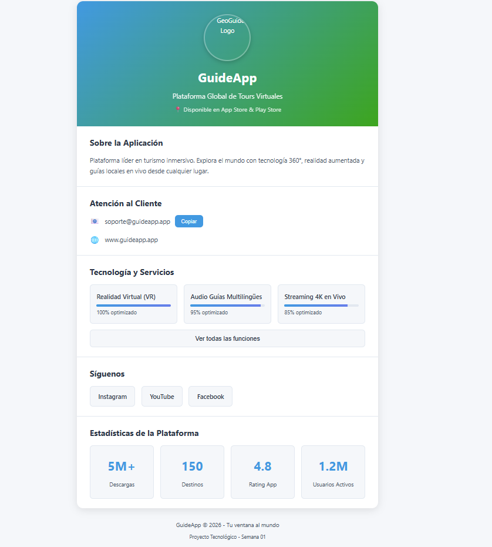

# Ficha de App de guías turísticas virtuales - Laurith Gil

## 📋 Información
- **Nombre**: Laurith Gil
- **Fecha**: 12/02/2026
- **Dominio Asignado**: App de guías turísticas virtuales
- **Entidad Principal**: GuideApp

## 🎯 Descripción
Información general y relevante de una App de guías turísticas virtuales llamada GuideApp.

## 📚 Conceptos ES2023 Aplicados
- [X] Variables con let/const
- [X] Template literals
- [X] Arrow functions
- [X] Destructuring
- [X] Optional chaining (?.)
- [X] Nullish coalescing (??)

## 🚀 Cómo Ejecutar
1. Abrir index.html en el navegador

## 📸 Screenshots

## 🎯 Autoevaluación
- Funcionalidad: [X]%
- Código ES2023: [X]%
- Código Limpio: [X]%
- Adaptación al Dominio: [X]%
- **Total Estimado**: [X]%