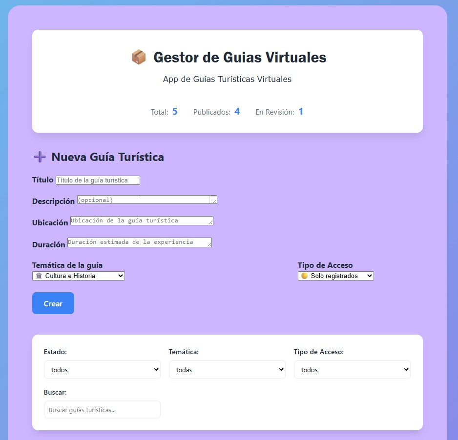
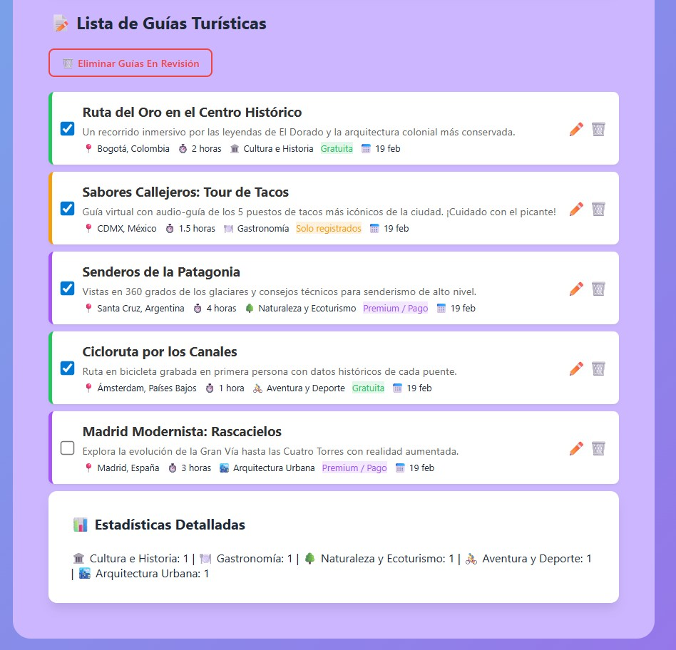

# Gestor de Colección App de guías turísticas virtuales - Laurith Gil

## 📋 Información
- **Nombre**: Laurith Gil
- **Fecha**: 19/02/2026
- **Dominio Asignado**: App de guías turísticas virtuales

## 🎯 Descripción
Gestor de Colección de guias turísticas virtuales.
Se adaptó el codigo base html al dominio de App de guias turistica virtuales, se modificó un poco el diseño en el css y se adaptó el Script a el domminio. Esto logrando una página interactiva en la cual se pueden agregar, eliminar, filtrar y editar guias turisticas. Tambien se logran ver estadisticas de estas guias y el total de ellas, incluyendo su estado (Publicadas o en Revisión).

## 🚀 Cómo Ejecutar
1. Abrir index.html en el navegador

## 📸 Screenshots
Antes de agregar las guías turísticas:

Después de agregar las guías turísticas, incluye guías en revisión (inactivos):

