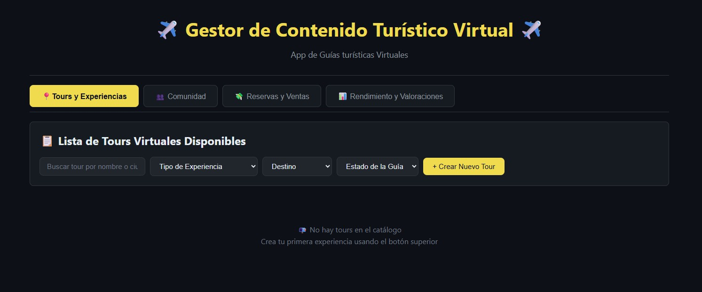
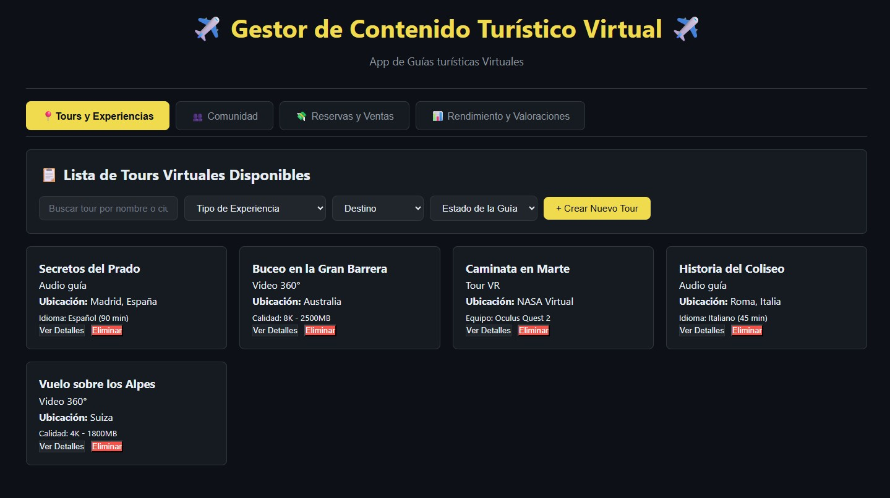

# ✈️ Sistema de Gestión con POO - App de guías turísticas virtuales - Laurith Gil

## 📋 Información
- **Nombre**: Laurith Gil
- **Fecha**: 26/02/2026
- **Dominio Asignado**: App de guías turísticas virtuales

## 🎯 Descripción
Sistema de Gestión con POO adaptado a App de guias turísticas virtuales.
Se adaptaron el codigo base html y el Script al dominio de App de guias turistica virtuales. Esto logrando una página interactiva en la cual se pueden agregar, eliminar y ver a detalle guias turisticas. Tambien se añadieron tours de prueba para lograr ver el correcto funcionamiento de este programa.

## 🚀 Cómo Ejecutar
1. Abrir index.html en el navegador

## 📸 Screenshots
Antes de agregar los tours:

Después de agregar tours:
